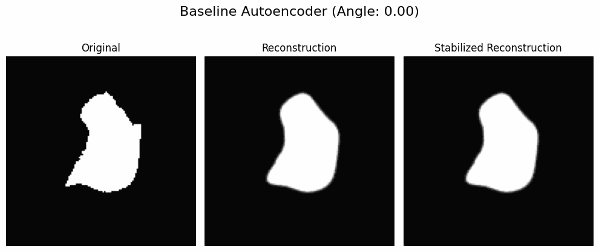

# RotaTouille – Rotation Equivariant Layers for Learning on Contour Data

This repository contains code for the paper *RotaTouille: Rotation Equivariant Deep Learning for Contours*. It implements rotation equivariant and invariant layers for deep learning on contour data. It also contains all code needed to reproduce the experiments from the paper.

## Visualization

We visualize equivariance in the case of a shape reconstructing autoencoder by rotating the input data.

**Figure 1:** Original and reconstructed shape from the autoencoder on contour data using our rotation equivariant layers. The stabilized reconstruction is visually constant under rotation.

**Figure 2:** Original and reconstructed shape from the autoencoder on binary images using standard CNN layers which are not rotation equivariant. The reconstructed shape changes under rotation of the input shape.

## Equivariant and Invariant Layers

The implementation of the different layers and some example models can be found in the `rotatouille` directory.

## Datasets

Scripts for generating the datasets can be found in the `datasets` directory.

## Experiments

This project uses `uv` for handling dependencies making everything easily reproducible. All dependencies are defined in `pyproject.toml` in case you want to use something other than `uv`. 

### Classification Experiments

Run `uv run train_classifier.py <model_name>` where `<model_name>` can be one of the following:

- `ours_fashion_mnist`: Rotation equivariant CNN on Fashion MNIST contour data.
- `baseline_contour_fashion_mnist`: Baseline CNN on Fashion MNIST contour binary images.
- `baseline_filled_fashion_mnist`: Baseline CNN on Fashion MNIST filled binary images.
- `baseline_gnn_fashion_mnist`: Baseline GNN on Fashion MNIST contour data using GCN layers.

- `ours_rot_mnist`: Rotation equivariant CNN on Rotated MNIST contour data.
- `ours_rh_rot_mnist`: Rotation equivariant CNN on Rotated MNIST contour data with invariant radial histogram features.

- `ours_modelnet`: Rotation equivariant CNN on ModelNet contour data.
- `baseline_contour_modelnet`: Baseline CNN on ModelNet contour binary images.
- `baseline_filled_modelnet`: Baseline CNN on ModelNet filled binary images.
- `baseline_gnn_modelnet`: Baseline GNN on ModelNet contour data using GCN layers.

### Autoencoder for Shape Reconstructions

Run `uv run autoencoder.py <model_name>` where `<model_name>` can be one of the following:

- `contour`: Equivariant complex-valued autoencoder.
- `image`: Standard CNN autoencoder on binary images.

### Curvature Regression

Run `uv run curvature_regression.py <model_name>` where `<model_name>` can be one of the following:

- `contour`: Equivariant curvature regression on contour data using the complex-valued autoencoder.
- `baseline_cnn`: Baseline curvature regression using a real-valued 1D CNN on Cartesian coordinates.
- `baseline_gcn`: Baseline GNN curvature regression using GCN layers on contour data. 

When creating the curvature dataset, you will get the mean absolute error and R2 for the numerical methods based on finite difference and circle fitting printed.
